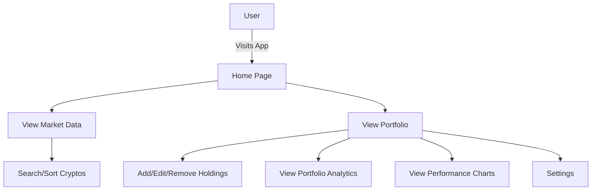

# Crypto_Portfolio

## 🚀 App Overview
Crypto Portfolio (Crypfolio) is a modern, privacy-friendly web app for tracking your cryptocurrency investments. It provides real-time market data, portfolio analytics, and a beautiful, responsive UI. All data is stored locally and automatically expires after 48 hours of inactivity for your privacy.

---

## 🌟 Features
- **Live Market Data:** View top 100 cryptocurrencies with price, market cap, and 24h change.
- **Personal Portfolio:** Add, edit, and remove your crypto holdings.
- **Portfolio Analytics:** See total value, profit/loss, best/worst assets, and more.
- **Performance Charts:** Visualize your portfolio's growth and asset allocation.
- **Search & Sort:** Quickly find and organize coins.
- **Privacy First:** All data is stored locally and auto-deletes after 48 hours of inactivity.
- **Mobile Friendly:** Fully responsive design.

---

## 🗺️ App Flow


---

## 🛠️ Getting Started
1. **Clone the repo:**
   ```bash
   git clone https://github.com/SiddharthFX/crypfolio.git
   cd Crypto_Portfolio
   ```
2. **Install dependencies:**
   ```bash
   npm install
   ```
3. **Run the app:**
   ```bash
   npm run dev
   ```
4. **Open in your browser:**
   Visit [http://localhost:5173](http://localhost:5173)

---

## 📄 License
MIT
